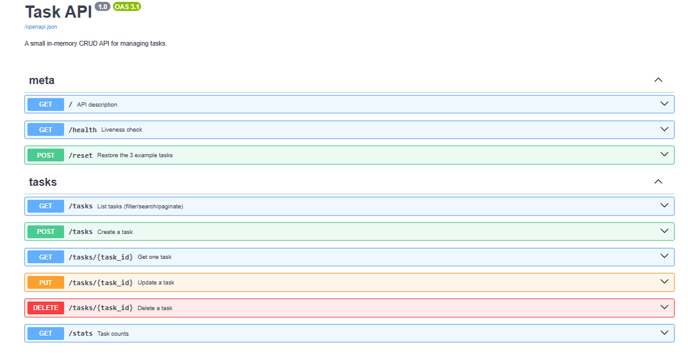

# Task API

A small CRUD API for managing a to-do list - built with **Python + FastAPI**, in-memory storage only (no database yet).

> FlyRank Internship · Backend Track · Week 2 · Assignment A1

## What this is

A minimal REST API that lets a client create, read, update, and delete tasks.
Data lives in a plain Python list — it resets every time the server restarts. That's intentional (see *The mortality experiment* below); a database arrives next week.

## How to install and run

```bash
pip install fastapi uvicorn
uvicorn main:app --reload --port 8000
```

Then open **http://localhost:8000/docs** for interactive Swagger UI, or hit the API directly with curl.

## Endpoints

| Method | Path          | Meaning                              | Success | Errors        |
|--------|---------------|---------------------------------------|---------|---------------|
| GET    | `/`           | API description                      | 200     | -             |
| GET    | `/health`     | Liveness check                        | 200     | -             |
| GET    | `/tasks`      | List tasks (supports filters below)   | 200     | -             |
| GET    | `/tasks/{id}` | Get one task                          | 200     | 404           |
| POST   | `/tasks`      | Create a task (`{"title": "..."}`)    | 201     | 400           |
| PUT    | `/tasks/{id}` | Update a task's `title` and/or `done` | 200     | 400, 404      |
| DELETE | `/tasks/{id}` | Delete a task                         | 204     | 404           |
| GET    | `/stats`      | `{ total, done, open }` counts        | 200     | -             |
| POST   | `/reset`      | Restore the 3 example tasks           | 200     | -             |

**Extras on `GET /tasks`:**
- `?done=true|false` - filter by completion
- `?search=milk` - case-insensitive title search
- `?limit=2&offset=2` - pagination

Every error response has the shape `{ "error": "..." }`.

## Example: full curl cycle

```bash
curl -i -X POST http://localhost:8000/tasks -H "Content-Type: application/json" -d '{"title":"Buy milk"}'
```

```
HTTP/1.1 201 Created
content-type: application/json

{"id":4,"title":"Buy milk","done":false}
```

```bash
curl -i http://localhost:8000/tasks/1        # 200, one task
curl -i http://localhost:8000/tasks/99       # 404, {"error":"Task 99 not found"}
curl -i -X PUT http://localhost:8000/tasks/1 -H "Content-Type: application/json" -d '{"done":true}'
curl -i -X DELETE http://localhost:8000/tasks/1   # 204, empty body
```

## Swagger UI

FastAPI generates interactive docs automatically at `/docs` — no extra setup. Every endpoint above is listed there with a "Try it out" button that fires real requests.



## Why pagination?

Real APIs never return "everything" - an unbounded `GET /tasks` on a table with a million rows would blow up response size, memory, and load time for both the client and server. `?limit` and `?offset` let a client ask for a manageable page at a time.

## The mortality experiment

Create a few tasks, restart the server, then `GET /tasks` again - the new tasks are gone; only the three defaults remain. That's because everything lives in a Python list in process memory, not on disk. This is the exact gap a database fills, which is why it's next on the roadmap.

## Requirements checklist

- [x] Server starts with one documented command
- [x] Full CRUD: GET/POST/PUT/DELETE all working on an in-memory list
- [x] Correct status codes: 200, 201, 204, 400, 404 - errors as JSON
- [x] POST/PUT validate input (missing/empty `title` → 400)
- [x] Swagger UI at `/docs`, full CRUD cycle via "Try it out"
- [x] Stretch: pagination via `?limit`/`?offset`
